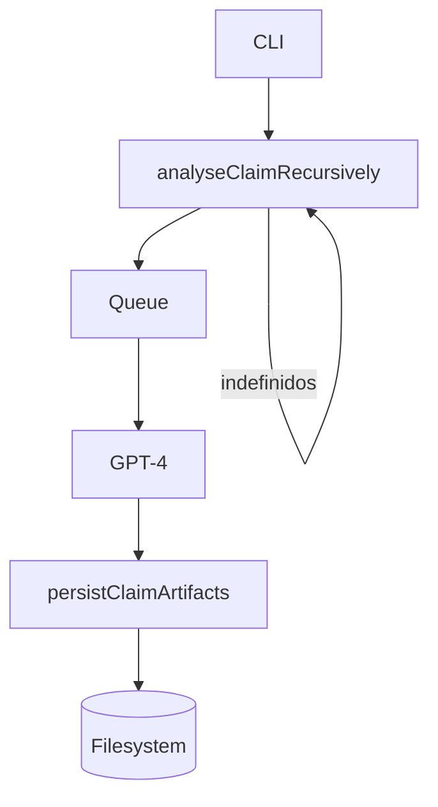

# Oriens Omni

> **Análisis Epistemológico Recursivo para Deno**
> *De la proposición al mapa de conocimiento verificable en un solo comando.*

[](https://deno.land/) 
[](#license) 


---

## ¿Por qué Oriens Omni?

Las herramientas LLM convencionales **resumen**; Oriens Omni **interroga**. Recibe una afirmación, la disgrega en partículas conceptuales, valida cada tramo con lógica booleana y desciende recursivamente sobre las incertidumbres hasta que colapsan o revelan teoría nueva. El resultado es un **grafo ontológico auto‑navegable** (JSON + Markdown) listo para auditoría humana o consumo de software.

---

## Tabla de contenidos

1. [Prestaciones clave](#prestaciones-clave)
2. [Instalación rápida](#instalación-rápida)
3. [Uso básico](#uso-básico)
4. [Anatomía de los archivos](#anatomía-de-los-archivos)
5. [Ontología emergente](#ontología-emergente)
6. [Configuración](#configuración)
7. [Flujo interno](#flujo-interno)
8. [Ampliación](#ampliación)
9. [Limitaciones y seguridad](#limitaciones-y-seguridad)
10. [Hoja de ruta](#hoja-de-ruta)
11. [Contribuciones](#contribuciones)
12. [Licencia](#licencia)

---

## Prestaciones clave

| Funcionalidad                  | Valor que aporta                                       |
| ------------------------------ | ------------------------------------------------------ |
| **Análisis recursivo**         | Explora en profundidad cada sub‑afirmación indefinida. |
| **Esquema JSON tipado**        | Claves estables para post‑procesado programático.      |
| **Render Markdown automático** | Documentos legibles e inter‑enlazados.                 |
| **Reanudación inteligente**    | Continúa sin repetir trabajos previos.                 |
| **Rate‑limit awareness**       | Back‑off exponencial y jitter.                         |
| **Prompt defensivo**           | Minimiza jailbreaks y alucinaciones.                   |

---

## Instalación rápida

```bash
# 1 · Instalar Deno ≥1.44
curl -fsSL https://deno.land/install.sh | sh

# 2 · Clonar Oriens Omni
git clone https://github.com/<tu-org>/oriens-omni.git && cd oriens-omni

# 3 · Exportar tu clave
export OPENAI_API_KEY=sk-...
```

---

## Uso básico

```bash
# Analizar una tesis
 deno run -A main.ts "La entropía decrece en sistemas cuánticos aislados"

# Reanudar un análisis interrumpido
 deno run -A main.ts resume entropia_decrece_en_sistemas_cuanticos_aislados
```

Se generará `proposiciones/<slug>/` con pares `.json` + `.md` numerados jerárquicamente.

---

## Anatomía de los archivos

```
proposiciones/
 └─ 0_el_tiempo_puede_detenerse_omniversalmente.json
     0_el_tiempo_puede_detenerse_omniversalmente.md
     0.1 ...  # sub‑ramas
```

Cada JSON sigue un **contrato ontológico**. Ejemplo (fragmento):

```jsonc
{
  "nodo_semantico_de_entrada": "El tiempo puede detenerse omniversalmente",
  "firma_ontologica": { "naturaleza": "afirmación modal" },
  "tabla_verdad": {
    "columnas": ["afirmacion", "verdadero", "falso", "indefinido"],
    "filas": [["El tiempo...", 0,0,1]]
  },
  "formula_booleana_del_argumento": "A && (!C)",
  ...
}
```

El Markdown adyacente es una proyección legible con tablas y enlaces `[[wikilink]]` hacia sub‑archivos.

---

## Ontología emergente

| Clave raíz                                           | Rol epistemológico                              | Tipo                   |
| ---------------------------------------------------- | ----------------------------------------------- | ---------------------- |
| `nodo_semantico_de_entrada`                          | Formulación textual original.                   | `string`               |
| `firma_ontologica`                                   | Naturaleza, dominio, tensión y límite del nodo. | `object`               |
| `tabla_verdad`                                       | Corte modal de las afirmaciones internas.       | `object`               |
| `formula_booleana_del_argumento`                     | Núcleo lógico mínimo.                           | `string` (JS‑bool)     |
| `iteraciones`                                        | Semillas para recursión.                        | `array<object>`        |
| `estado_booleano_colapsado_por_calculo_determinista` | Resultado evaluado automáticamente.             | `boolean \| undefined` |

> **Nota** Las claves son estables; cada nueva release incrementa `SCHEMA_VERSION` para romper cache limpio.

---

## Configuración

Variables de entorno relevantes:

| Variable         | Obligatoria | Descripción                                |
| ---------------- | ----------- | ------------------------------------------ |
| `OPENAI_API_KEY` | ✔           | Clave GPT‑4, GPT‑4o o equivalente.         |
| `AZURE_OPENAI_*` | opcional    | Endpoint y deployment si usas Azure.       |
| `MODEL`          | opcional    | Nombre del modelo (default `gpt-4o-mini`). |

---

## Flujo interno



---

## Ampliación

* **Parser seguro** → sustituir `eval` por un AST booleano (`jsep`).
* **Visualización** → alimentar los JSON a D3 o a Obsidian para grafo interactivo.
* **Drivers alternativos** → Anthropic, Mistral o Llama‑cpp vía wrapper.

---

## Limitaciones y seguridad

* **`eval` experimental**. Ejecuta expresiones generadas por IA; **no apto para producción** sin sandbox.
* Sin límite de profundidad por defecto — controla tu coste con `--depth`.
* La estructura JSON se rompe si el modelo no responde exactamente al esquema; usa `--dry-run` para depurar.

---

## Hoja de ruta

* [ ] v0.5 CLI con sub‑comandos y flags declarativas.
* [ ] v0.6 Logger estructurado + `deno task lint`.
* [ ] v0.7 Generación automática de diagramas Mermaid.
* [ ] v1.0 Parser booleano seguro y esquema estable.

---

## Contribuciones

1. Crea un *fork* y una rama descriptiva.
2. Ejecuta `deno task format && deno lint`.
3. Abre un PR siguiendo el estilo *conventional commits*.

---

## Licencia

MIT © 2025 Automation to Business LLC.
